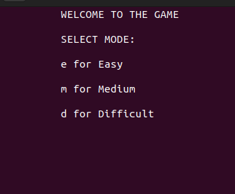

# THE UNSEEN JOURNEY QUEST

## DESCRIPTION
Trapped in a dark maze, you can only see the ground beneath your feet. Somewhere in
the shadows, a hidden key unlocks the way out, but you can’t see it, and you don’t know
where it is. You can sense when you’re moving closer to the key, guiding your steps
through the darkness.

## Table of Contents
- [Installation](#installation)
- [Usage](#usage)
- [Rules](#rules)
- [Features](#features)
- [CopyRight](#CopyRight)

## Installation
1. Clone the repository: `git clone https://github.com/tahainam555/maze-game.git`
2. Navigate into the directory.
3. Install Curses Library.

## Usage
To, start the game, run:
./1
Or if you want to change something after changing compile again using:
g++ -o 1 main.cpp -lncurses
Then run using:
./1

## Rules
When the game runs remember the following things:
1. Use w, a, s, d to move up, left, down and right respectively, q for undo and e to exit.
2. After each move you will be displayed weather you re moving closer or away from target.

3. You have calculated no. of moves and undoes, So use wisely.
4. Colliding a bomb or running out of moves wil result in a loss.
5. You win if you find the key and then the door in the moves provided.
6. Pick coins to increase score and undoes.
7. Different modes of game:
# EASY

# Medium

# Difficult

# GAME OVER
  

## Features
1. mind game.
2. smooth game controls.
3. Terminal based UI.
4. Easy to understand.

## CopyRight
- Rights reserved © 2024, tahainam555
